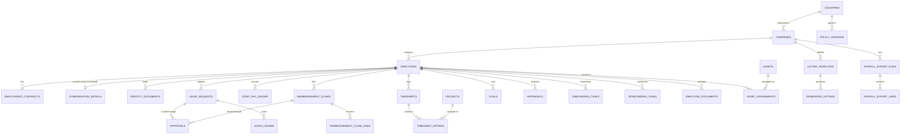

# 2. Database Schema

Full DDL is in [`schema/schema.sql`](../schema/schema.sql). This document explains the design
decisions; read it alongside the SQL.

## 2.1 Entity groups



## 2.2 Identity & access tables

| Table | Purpose |
|---|---|
| `profiles` | 1:1 with `auth.users`; display name, locale, status. No sensitive HR data. |
| `roles` (enum `app_role`) | `employee`, `line_manager`, `hr_admin`, `finance`, `ceo`, `sys_admin` |
| `user_roles` | `(user_id, role, company_id nullable, country_code nullable)` — a user can hold several roles, optionally scoped to a company/country (e.g. HR Admin for Poland only). Unscoped row = applies everywhere the role type is meaningful. |
| `employees` | The HR master record; `user_id` nullable (a person can exist as an employee record before their login is provisioned, or after offboarding while login is revoked). |

Roles are **not** stored as Supabase Auth custom claims/JWT metadata, because revoking a role must
take effect immediately without waiting for token refresh. Every RLS policy and every Server Action
re-checks `user_roles` against the live `auth.uid()` on each request via `SECURITY DEFINER` helper
functions (`has_role`, `is_manager_of`, `same_company`), listed in §2.6.

A `profiles` row is created automatically the moment an `auth.users` row is (a
`SECURITY DEFINER` trigger, `handle_new_auth_user`) — inviting a user never requires a separate
manual "now go create their profile" step. `countries`, `companies`, `departments`, and `profiles`
are all low-sensitivity reference/directory data: readable by any signed-in user (so name pickers,
manager selectors, and org browsing work without a special case), writable only by Sys Admin
(companies/countries — structural) or HR Admin scoped to their company (departments).

## 2.3 Employee, contract and sensitive-data separation

- `employees`: name, org placement (`company_id`, `department_id`, `manager_id`), job title,
  employment status, dates. **No salary, no bank details, no government ID numbers.**
- `employment_contracts`: append-only contract history. A change (renewal, salary revision, role
  change) never updates a row — it inserts a new contract version and sets the previous row's
  `is_current = false`, `superseded_by = <new id>`. `effective_from`/`effective_to` give a clean
  timeline; `get_contract_as_of(employee_id, date)` is the single reader function.
- `compensation_details`: salary, currency, allowances (`jsonb`), bank name/IBAN/SWIFT. Same
  versioning pattern as contracts. Locked down to `hr_admin`, `finance`, `sys_admin` (config only,
  no row access) and the employee's own **read-only** row (configurable per company — some
  companies choose not to let employees see raw bank data they didn't enter; default: employee can
  read, not write, their own compensation row; bank fields writable only by HR Admin/Finance after
  employee-submitted change request).
- `identity_documents`: passport, Emirates ID, Iqama, PESEL, etc. Separate table, separate RLS,
  because "who can see contract data" and "who can see passport numbers" are different audiences in
  practice (e.g. Finance needs compensation but not ID numbers).
- `appraisals`/`goals`: separate RLS again — visible to the employee, their direct manager chain,
  and HR Admin; **not** to Finance or plain line managers outside the chain.

This gives four independent sensitivity tiers on top of the same employee, matching the task's
"separate access controls for salary, bank, ID and appraisal data" requirement directly in the
schema rather than via row-level flags on one wide table (which would be easy to misconfigure).

## 2.4 Policy versioning (no hard-coded country law)

```
policy_versions
  id, country_code, policy_type ('leave_rules' | 'public_holidays' | 'overtime_rules'
                                  | 'notice_period' | 'probation_rules' | 'working_week'),
  version_no, effective_from, effective_to (nullable = open-ended),
  status ('draft' | 'active' | 'superseded'),
  payload jsonb,      -- shape depends on policy_type, validated in app layer with zod schemas
  created_by, approved_by, created_at
```

- Only one `active` version per `(country_code, policy_type)` may have an open-ended or overlapping
  date range — enforced by an exclusion constraint (`EXCLUDE USING gist` on
  `(country_code, policy_type) WITH =, daterange(effective_from, effective_to) WITH &&`) so
  overlapping effective ranges are rejected by the database itself, not just app validation.
- Resolution is one function: `resolve_policy(country_code, policy_type, as_of date) -> payload`.
  Every leave calculation, notice-period check, and holiday lookup goes through it. Nothing in the
  codebase is allowed to say `if (country === 'AE') { ... }` for a business rule — country
  differences live only in `payload`.
- `policy_leave_types`: normalized child of a `leave_rules` policy version — one row per leave type
  per country per version (`leave_type_code`, `accrual_method`, `accrual_rate_per_period`,
  `max_balance`, `carryover_max_days`, `carryover_expiry_months`, `min_service_days_to_accrue`,
  `requires_medical_cert_after_days`, `approval_levels_required`, `gender_restricted` nullable).
  This is a normalized table (not just `jsonb`) because leave balance math needs to query it
  relationally and it benefits from constraints/tests.
- `public_holidays`: `(country_code, holiday_date, name, is_paid)` — used by the day-count
  calculator so requesting leave across a public holiday doesn't consume a leave day.

## 2.5 Leave, comp-off, and deduction priority

- `leave_requests`: one row per request; `total_days` is **computed and stored at submission time**
  by the deterministic domain function (using policy + holiday calendar + half-day flags), never
  computed ad hoc by the UI, and re-validated server-side on submit.
- `approvals`: generic, polymorphic (`entity_type`, `entity_id`) append-only decision log used by
  leave requests, reimbursement claims, timesheets, and letter issuance. One row per
  approver-per-step-per-decision; a re-submission after rejection creates a new set of rows rather
  than overwriting. This is the traceability backbone — "every approval must be traceable" is
  satisfied by never updating a decision, only adding to the log.
- `leave_ledger`: append-only. Columns: `employee_id, leave_type_code, txn_date, entry_type
  ('accrual'|'deduction'|'adjustment'|'carryover'|'encashment'|'reversal'), amount_days
  (signed: accrual positive, deduction negative), reference_type, reference_id, created_by,
  created_at, reversal_of_id`. **Current balance is never a stored mutable column** — it's
  `SUM(amount_days)` up to a date, exposed via the `leave_balances` view (materialized nightly for
  dashboard performance, always re-derivable from the ledger). This makes balance corruption
  structurally impossible: there is no "balance" field to accidentally overwrite.
- `comp_day_ledger`: same append-only pattern, dedicated to compensatory/recovery days, with an
  `expiry_date` per earned entry (e.g. "expires 60 days after being earned") consumed FIFO by the
  deterministic deduction engine.
- `deduction_priority_rules`: `(scope: company_id|country_code, leave_type_code, source_ledger
  ['comp_day'|'annual_leave'|...], priority_order, effective_from)`. When an employee requests time
  off that could be drawn from more than one balance (e.g. comp-off first, then annual leave), the
  domain engine reads this table to decide draw order — configurable per company/country without a
  code change.

## 2.6 RLS helper functions (used across all policies)

```sql
current_employee_id()            -- employees row for auth.uid(), or null
has_role(role app_role, company_id uuid default null, country_code text default null)
is_manager_of(target_employee_id uuid)   -- walks employees.manager_id chain
same_company(target_employee_id uuid)
```

All are `SECURITY DEFINER`, `STABLE`, owned by a locked-down role, and only ever `SELECT` from
`user_roles`/`employees` — they contain no business logic, keeping RLS policies short and reviewable.

## 2.7 Audit log & AI drafts

- `audit_log`: insert-only (`REVOKE UPDATE, DELETE ... FROM PUBLIC`, plus no policy grants either
  action to any role including `service_role` at the table-grant level — only a break-glass
  migration run outside the app can alter it). Populated two ways:
  1. Generic `AFTER INSERT OR UPDATE OR DELETE` trigger on every guarded table, capturing
     before/after `jsonb`.
  2. Explicit domain-level entries for business events that aren't simple row changes (e.g. "leave
     request approved at step 2 of 3", "payroll export run #45 generated").
- `ai_drafts`: `(entity_type, entity_id nullable, proposed_action, proposed_payload jsonb,
  rationale, created_by_agent, status ['draft'|'authorized'|'rejected'|'discarded'],
  authorized_by, authorized_at)`. No RLS policy grants `service_role`/AI integrations write access
  to any operational table other than this one. Turning a draft into a real change means a human
  user, under their own RLS identity, performs the normal Server Action (e.g. "approve leave
  request"), which may pre-fill from the draft but executes as that human's action — logged in
  `audit_log` as theirs, with `ai_drafts.status` flipped to `authorized` and linked via
  `reference_id` for traceability back to the suggestion.

## 2.8 Soft delete

Business record tables (`employees`, `employment_contracts` rows are never deleted, only
superseded; `reimbursement_claims`, `assets`, `employee_documents`, `letter_templates`, `projects`)
carry `deleted_at timestamptz`, `deleted_by uuid`. RLS `SELECT` policies filter
`deleted_at IS NULL` by default; a `hr_admin`/`sys_admin`-only view exposes soft-deleted rows for
recovery/audit. Ledgers, `approvals`, and `audit_log` are never deleted, soft or hard — deletion
would break the traceability guarantee.

## 2.9 Storage buckets

| Bucket | Path convention | Access |
|---|---|---|
| `employee-documents` | `{company_id}/{employee_id}/{document_type}/{filename}` | Owner employee (read), their manager (no), HR Admin (read/write), Sys Admin (no content access) |
| `receipts` | `{company_id}/{employee_id}/{claim_id}/{filename}` | Owner employee (write on own draft claims), approving manager + Finance (read), HR Admin (read) |
| `identity-documents` | `{company_id}/{employee_id}/{doc_type}/{filename}` | HR Admin only + owner (read own) |
| `letters` | `{company_id}/{employee_id}/{letter_id}.pdf` | Owner (read), HR Admin (read/write) |
| `assets` (photos/condition reports) | `{company_id}/{asset_id}/{filename}` | HR Admin, Finance (read) |

Storage RLS mirrors table RLS using the same `has_role`/`same_company`/`is_manager_of` functions
via Supabase Storage's policy support on `storage.objects`, keyed off the path segments.

Proceed to [03-permission-matrix.md](./03-permission-matrix.md).
